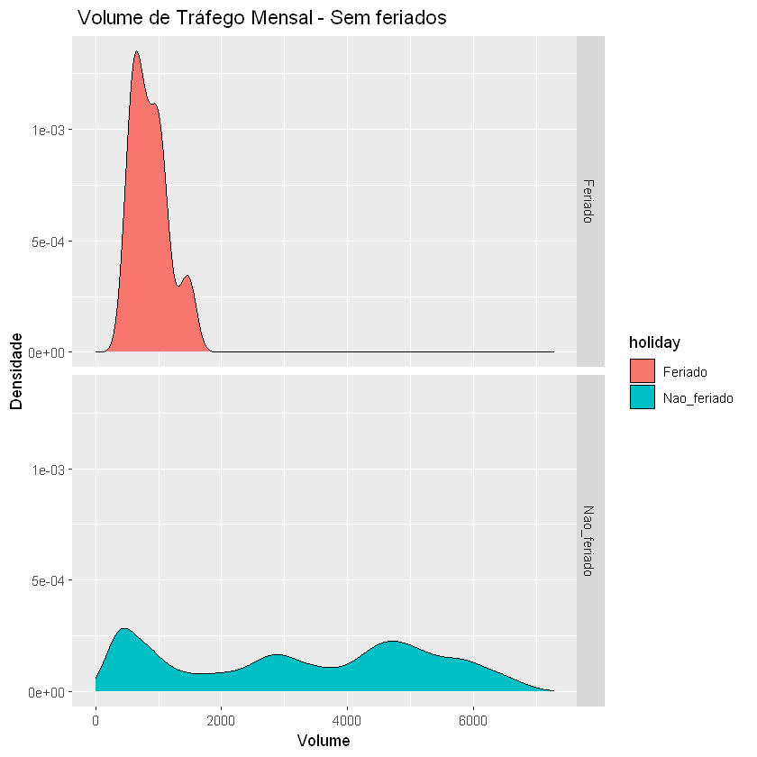

> # Análise de Tráfego em Minneápolis


> ###### Rálisson Araújo Ribeiro

> ###### Este estudo é sobre o volume de tráfego na rodovia Interstadual 94 que fica em Minneapolis que foi disponibilizado em um dataset de estudo do UCI - Machine Learning Repository

> ###### https://archive.ics.uci.edu/ml/datasets/Metro+Interstate+Traffic+Volume

https://www.google.com.br/maps/place/Interstate+94+%26+Huron+Transit+Station/@44.9640118,-93.963515,7.37z/data=!4m5!3m4!1s0x52b32d26dd6b4607:0x21dca55c372bfdc1!8m2!3d44.96756!4d-93.222691

> ##### Instalando pacotes e bibliotecas


```R
install.packages("dplyr")
install.packages("readyr")
install.packages("lubridate")
install.packages("ggplot2")
install.packages("TSstudio")
```

    package 'dplyr' successfully unpacked and MD5 sums checked
    
    The downloaded binary packages are in
    	C:\Users\ralis\AppData\Local\Temp\Rtmpu063wY\downloaded_packages
    

    Warning message:
    "package 'readyr' is not available (for R version 3.6.1)"

    package 'lubridate' successfully unpacked and MD5 sums checked
    
    The downloaded binary packages are in
    	C:\Users\ralis\AppData\Local\Temp\Rtmpu063wY\downloaded_packages
    package 'ggplot2' successfully unpacked and MD5 sums checked
    
    The downloaded binary packages are in
    	C:\Users\ralis\AppData\Local\Temp\Rtmpu063wY\downloaded_packages
    package 'TSstudio' successfully unpacked and MD5 sums checked
    
    The downloaded binary packages are in
    	C:\Users\ralis\AppData\Local\Temp\Rtmpu063wY\downloaded_packages
    


```R
library(dplyr)
library(readr)
library(lubridate)
library(ggplot2)
library(TSstudio)
```

    Warning message:
    "package 'dplyr' was built under R version 3.6.3"
    Attaching package: 'dplyr'
    
    The following objects are masked from 'package:stats':
    
        filter, lag
    
    The following objects are masked from 'package:base':
    
        intersect, setdiff, setequal, union
    
    Warning message:
    "package 'readr' was built under R version 3.6.3"Warning message:
    "package 'lubridate' was built under R version 3.6.3"
    Attaching package: 'lubridate'
    
    The following objects are masked from 'package:base':
    
        date, intersect, setdiff, union
    
    Warning message:
    "package 'ggplot2' was built under R version 3.6.3"Warning message:
    "package 'TSstudio' was built under R version 3.6.3"

> #### Analise exploratória de dados


```R
base <- read_csv('Metro_Interstate_Traffic_Volume.csv')
head(base)
class(base)
```

    Parsed with column specification:
    cols(
      holiday = col_character(),
      temp = col_double(),
      rain_1h = col_double(),
      snow_1h = col_double(),
      clouds_all = col_double(),
      weather_main = col_character(),
      weather_description = col_character(),
      date_time = col_datetime(format = ""),
      traffic_volume = col_double()
    )
    


<table>
<thead><tr><th scope=col>holiday</th><th scope=col>temp</th><th scope=col>rain_1h</th><th scope=col>snow_1h</th><th scope=col>clouds_all</th><th scope=col>weather_main</th><th scope=col>weather_description</th><th scope=col>date_time</th><th scope=col>traffic_volume</th></tr></thead>
<tbody>
	<tr><td>None               </td><td>288.28             </td><td>0                  </td><td>0                  </td><td>40                 </td><td>Clouds             </td><td>scattered clouds   </td><td>2012-10-02 09:00:00</td><td>5545               </td></tr>
	<tr><td>None               </td><td>289.36             </td><td>0                  </td><td>0                  </td><td>75                 </td><td>Clouds             </td><td>broken clouds      </td><td>2012-10-02 10:00:00</td><td>4516               </td></tr>
	<tr><td>None               </td><td>289.58             </td><td>0                  </td><td>0                  </td><td>90                 </td><td>Clouds             </td><td>overcast clouds    </td><td>2012-10-02 11:00:00</td><td>4767               </td></tr>
	<tr><td>None               </td><td>290.13             </td><td>0                  </td><td>0                  </td><td>90                 </td><td>Clouds             </td><td>overcast clouds    </td><td>2012-10-02 12:00:00</td><td>5026               </td></tr>
	<tr><td>None               </td><td>291.14             </td><td>0                  </td><td>0                  </td><td>75                 </td><td>Clouds             </td><td>broken clouds      </td><td>2012-10-02 13:00:00</td><td>4918               </td></tr>
	<tr><td>None               </td><td>291.72             </td><td>0                  </td><td>0                  </td><td> 1                 </td><td>Clear              </td><td>sky is clear       </td><td>2012-10-02 14:00:00</td><td>5181               </td></tr>
</tbody>
</table>


<ol class=list-inline>
	<li>'spec_tbl_df'</li>
	<li>'tbl_df'</li>
	<li>'tbl'</li>
	<li>'data.frame'</li>
</ol>


```R
dados <-base
head(dados)
```


<table>
<thead><tr><th scope=col>holiday</th><th scope=col>temp</th><th scope=col>rain_1h</th><th scope=col>snow_1h</th><th scope=col>clouds_all</th><th scope=col>weather_main</th><th scope=col>weather_description</th><th scope=col>date_time</th><th scope=col>traffic_volume</th></tr></thead>
<tbody>
	<tr><td>None               </td><td>288.28             </td><td>0                  </td><td>0                  </td><td>40                 </td><td>Clouds             </td><td>scattered clouds   </td><td>2012-10-02 09:00:00</td><td>5545               </td></tr>
	<tr><td>None               </td><td>289.36             </td><td>0                  </td><td>0                  </td><td>75                 </td><td>Clouds             </td><td>broken clouds      </td><td>2012-10-02 10:00:00</td><td>4516               </td></tr>
	<tr><td>None               </td><td>289.58             </td><td>0                  </td><td>0                  </td><td>90                 </td><td>Clouds             </td><td>overcast clouds    </td><td>2012-10-02 11:00:00</td><td>4767               </td></tr>
	<tr><td>None               </td><td>290.13             </td><td>0                  </td><td>0                  </td><td>90                 </td><td>Clouds             </td><td>overcast clouds    </td><td>2012-10-02 12:00:00</td><td>5026               </td></tr>
	<tr><td>None               </td><td>291.14             </td><td>0                  </td><td>0                  </td><td>75                 </td><td>Clouds             </td><td>broken clouds      </td><td>2012-10-02 13:00:00</td><td>4918               </td></tr>
	<tr><td>None               </td><td>291.72             </td><td>0                  </td><td>0                  </td><td> 1                 </td><td>Clear              </td><td>sky is clear       </td><td>2012-10-02 14:00:00</td><td>5181               </td></tr>
</tbody>
</table>


```R
dados <- select(base,'date_time', 'traffic_volume','holiday' )

class(dados)
head(dados)
```


<ol class=list-inline>
	<li>'tbl_df'</li>
	<li>'tbl'</li>
	<li>'data.frame'</li>
</ol>


<table>
<thead><tr><th scope=col>date_time</th><th scope=col>traffic_volume</th><th scope=col>holiday</th></tr></thead>
<tbody>
	<tr><td>2012-10-02 09:00:00</td><td>5545               </td><td>None               </td></tr>
	<tr><td>2012-10-02 10:00:00</td><td>4516               </td><td>None               </td></tr>
	<tr><td>2012-10-02 11:00:00</td><td>4767               </td><td>None               </td></tr>
	<tr><td>2012-10-02 12:00:00</td><td>5026               </td><td>None               </td></tr>
	<tr><td>2012-10-02 13:00:00</td><td>4918               </td><td>None               </td></tr>
	<tr><td>2012-10-02 14:00:00</td><td>5181               </td><td>None               </td></tr>
</tbody>
</table>


```R
dados$ano <-year(dados$date_time)
dados$mes <-as.factor(month(dados$date_time,  label = TRUE))
dados$dia <-day(dados$date_time)
dados$hora <-as.factor(hour(dados$date_time))
dados$semana <-week(dados$date_time)
dados$data <- date(dados$date_time)
dados$dia_da_semana <- as.factor(wday(dados$date_time, label = TRUE))
dados$holiday <- ifelse(dados$holiday =="None", "Nao_feriado", "Feriado")

head(dados)
str(dados)
```


<table>
<thead><tr><th scope=col>date_time</th><th scope=col>traffic_volume</th><th scope=col>holiday</th><th scope=col>ano</th><th scope=col>mes</th><th scope=col>dia</th><th scope=col>hora</th><th scope=col>semana</th><th scope=col>data</th><th scope=col>dia_da_semana</th></tr></thead>
<tbody>
	<tr><td>2012-10-02 09:00:00</td><td>5545               </td><td>Nao_feriado        </td><td>2012               </td><td>out                </td><td>2                  </td><td>9                  </td><td>40                 </td><td>2012-10-02         </td><td>ter                </td></tr>
	<tr><td>2012-10-02 10:00:00</td><td>4516               </td><td>Nao_feriado        </td><td>2012               </td><td>out                </td><td>2                  </td><td>10                 </td><td>40                 </td><td>2012-10-02         </td><td>ter                </td></tr>
	<tr><td>2012-10-02 11:00:00</td><td>4767               </td><td>Nao_feriado        </td><td>2012               </td><td>out                </td><td>2                  </td><td>11                 </td><td>40                 </td><td>2012-10-02         </td><td>ter                </td></tr>
	<tr><td>2012-10-02 12:00:00</td><td>5026               </td><td>Nao_feriado        </td><td>2012               </td><td>out                </td><td>2                  </td><td>12                 </td><td>40                 </td><td>2012-10-02         </td><td>ter                </td></tr>
	<tr><td>2012-10-02 13:00:00</td><td>4918               </td><td>Nao_feriado        </td><td>2012               </td><td>out                </td><td>2                  </td><td>13                 </td><td>40                 </td><td>2012-10-02         </td><td>ter                </td></tr>
	<tr><td>2012-10-02 14:00:00</td><td>5181               </td><td>Nao_feriado        </td><td>2012               </td><td>out                </td><td>2                  </td><td>14                 </td><td>40                 </td><td>2012-10-02         </td><td>ter                </td></tr>
</tbody>
</table>


    tibble [48,204 x 10] (S3: tbl_df/tbl/data.frame)
     $ date_time     : POSIXct[1:48204], format: "2012-10-02 09:00:00" "2012-10-02 10:00:00" ...
     $ traffic_volume: num [1:48204] 5545 4516 4767 5026 4918 ...
     $ holiday       : chr [1:48204] "Nao_feriado" "Nao_feriado" "Nao_feriado" "Nao_feriado" ...
     $ ano           : num [1:48204] 2012 2012 2012 2012 2012 ...
     $ mes           : Ord.factor w/ 12 levels "jan"<"fev"<"mar"<..: 10 10 10 10 10 10 10 10 10 10 ...
     $ dia           : int [1:48204] 2 2 2 2 2 2 2 2 2 2 ...
     $ hora          : Factor w/ 24 levels "0","1","2","3",..: 10 11 12 13 14 15 16 17 18 19 ...
     $ semana        : num [1:48204] 40 40 40 40 40 40 40 40 40 40 ...
     $ data          : Date[1:48204], format: "2012-10-02" "2012-10-02" ...
     $ dia_da_semana : Ord.factor w/ 7 levels "dom"<"seg"<"ter"<..: 3 3 3 3 3 3 3 3 3 3 ...
    


```R
dados_no_feriado <- dados %>%
    filter(holiday =="Nao_feriado")
   

head(dados_no_feriado)
```


<table>
<thead><tr><th scope=col>date_time</th><th scope=col>traffic_volume</th><th scope=col>holiday</th><th scope=col>ano</th><th scope=col>mes</th><th scope=col>dia</th><th scope=col>hora</th><th scope=col>semana</th><th scope=col>data</th><th scope=col>dia_da_semana</th></tr></thead>
<tbody>
	<tr><td>2012-10-02 09:00:00</td><td>5545               </td><td>Nao_feriado        </td><td>2012               </td><td>out                </td><td>2                  </td><td>9                  </td><td>40                 </td><td>2012-10-02         </td><td>ter                </td></tr>
	<tr><td>2012-10-02 10:00:00</td><td>4516               </td><td>Nao_feriado        </td><td>2012               </td><td>out                </td><td>2                  </td><td>10                 </td><td>40                 </td><td>2012-10-02         </td><td>ter                </td></tr>
	<tr><td>2012-10-02 11:00:00</td><td>4767               </td><td>Nao_feriado        </td><td>2012               </td><td>out                </td><td>2                  </td><td>11                 </td><td>40                 </td><td>2012-10-02         </td><td>ter                </td></tr>
	<tr><td>2012-10-02 12:00:00</td><td>5026               </td><td>Nao_feriado        </td><td>2012               </td><td>out                </td><td>2                  </td><td>12                 </td><td>40                 </td><td>2012-10-02         </td><td>ter                </td></tr>
	<tr><td>2012-10-02 13:00:00</td><td>4918               </td><td>Nao_feriado        </td><td>2012               </td><td>out                </td><td>2                  </td><td>13                 </td><td>40                 </td><td>2012-10-02         </td><td>ter                </td></tr>
	<tr><td>2012-10-02 14:00:00</td><td>5181               </td><td>Nao_feriado        </td><td>2012               </td><td>out                </td><td>2                  </td><td>14                 </td><td>40                 </td><td>2012-10-02         </td><td>ter                </td></tr>
</tbody>
</table>


```R
dados_feriado <- dados %>%
    filter(holiday =="Feriado")
    

head(dados_feriado)
```


<table>
<thead><tr><th scope=col>date_time</th><th scope=col>traffic_volume</th><th scope=col>holiday</th><th scope=col>ano</th><th scope=col>mes</th><th scope=col>dia</th><th scope=col>hora</th><th scope=col>semana</th><th scope=col>data</th><th scope=col>dia_da_semana</th></tr></thead>
<tbody>
	<tr><td>2012-10-08</td><td> 455      </td><td>Feriado   </td><td>2012      </td><td>out       </td><td> 8        </td><td>0         </td><td>41        </td><td>2012-10-08</td><td>seg       </td></tr>
	<tr><td>2012-11-12</td><td>1000      </td><td>Feriado   </td><td>2012      </td><td>nov       </td><td>12        </td><td>0         </td><td>46        </td><td>2012-11-12</td><td>seg       </td></tr>
	<tr><td>2012-11-22</td><td> 919      </td><td>Feriado   </td><td>2012      </td><td>nov       </td><td>22        </td><td>0         </td><td>47        </td><td>2012-11-22</td><td>qui       </td></tr>
	<tr><td>2012-12-25</td><td> 803      </td><td>Feriado   </td><td>2012      </td><td>dez       </td><td>25        </td><td>0         </td><td>52        </td><td>2012-12-25</td><td>ter       </td></tr>
	<tr><td>2013-01-01</td><td>1439      </td><td>Feriado   </td><td>2013      </td><td>jan       </td><td> 1        </td><td>0         </td><td> 1        </td><td>2013-01-01</td><td>ter       </td></tr>
	<tr><td>2013-02-18</td><td> 556      </td><td>Feriado   </td><td>2013      </td><td>fev       </td><td>18        </td><td>0         </td><td> 7        </td><td>2013-02-18</td><td>seg       </td></tr>
</tbody>
</table>


```R
# Vamos criar novas colunas para ano, mês, dia da semana, hora e etc na base Dados_no_feriado


dados_no_feriado$ano <-year(dados_no_feriado$date_time)
dados_no_feriado$mes <-as.factor(month(dados_no_feriado$date_time,  label = TRUE))
dados_no_feriado$dia <-day(dados_no_feriado$date_time)
dados_no_feriado$hora <-as.factor(hour(dados_no_feriado$date_time))
dados_no_feriado$semana <-week(dados_no_feriado$date_time)
dados_no_feriado$data <- date(dados_no_feriado$date_time)
dados_no_feriado$dia_da_semana <- as.factor(wday(dados_no_feriado$date_time, label = TRUE))

head(dados_no_feriado)
str(dados_no_feriado)

```


<table>
<thead><tr><th scope=col>date_time</th><th scope=col>traffic_volume</th><th scope=col>holiday</th><th scope=col>ano</th><th scope=col>mes</th><th scope=col>dia</th><th scope=col>hora</th><th scope=col>semana</th><th scope=col>data</th><th scope=col>dia_da_semana</th></tr></thead>
<tbody>
	<tr><td>2012-10-02 09:00:00</td><td>5545               </td><td>Nao_feriado        </td><td>2012               </td><td>out                </td><td>2                  </td><td>9                  </td><td>40                 </td><td>2012-10-02         </td><td>ter                </td></tr>
	<tr><td>2012-10-02 10:00:00</td><td>4516               </td><td>Nao_feriado        </td><td>2012               </td><td>out                </td><td>2                  </td><td>10                 </td><td>40                 </td><td>2012-10-02         </td><td>ter                </td></tr>
	<tr><td>2012-10-02 11:00:00</td><td>4767               </td><td>Nao_feriado        </td><td>2012               </td><td>out                </td><td>2                  </td><td>11                 </td><td>40                 </td><td>2012-10-02         </td><td>ter                </td></tr>
	<tr><td>2012-10-02 12:00:00</td><td>5026               </td><td>Nao_feriado        </td><td>2012               </td><td>out                </td><td>2                  </td><td>12                 </td><td>40                 </td><td>2012-10-02         </td><td>ter                </td></tr>
	<tr><td>2012-10-02 13:00:00</td><td>4918               </td><td>Nao_feriado        </td><td>2012               </td><td>out                </td><td>2                  </td><td>13                 </td><td>40                 </td><td>2012-10-02         </td><td>ter                </td></tr>
	<tr><td>2012-10-02 14:00:00</td><td>5181               </td><td>Nao_feriado        </td><td>2012               </td><td>out                </td><td>2                  </td><td>14                 </td><td>40                 </td><td>2012-10-02         </td><td>ter                </td></tr>
</tbody>
</table>


    tibble [48,143 x 10] (S3: tbl_df/tbl/data.frame)
     $ date_time     : POSIXct[1:48143], format: "2012-10-02 09:00:00" "2012-10-02 10:00:00" ...
     $ traffic_volume: num [1:48143] 5545 4516 4767 5026 4918 ...
     $ holiday       : chr [1:48143] "Nao_feriado" "Nao_feriado" "Nao_feriado" "Nao_feriado" ...
     $ ano           : num [1:48143] 2012 2012 2012 2012 2012 ...
     $ mes           : Ord.factor w/ 12 levels "jan"<"fev"<"mar"<..: 10 10 10 10 10 10 10 10 10 10 ...
     $ dia           : int [1:48143] 2 2 2 2 2 2 2 2 2 2 ...
     $ hora          : Factor w/ 24 levels "0","1","2","3",..: 10 11 12 13 14 15 16 17 18 19 ...
     $ semana        : num [1:48143] 40 40 40 40 40 40 40 40 40 40 ...
     $ data          : Date[1:48143], format: "2012-10-02" "2012-10-02" ...
     $ dia_da_semana : Ord.factor w/ 7 levels "dom"<"seg"<"ter"<..: 3 3 3 3 3 3 3 3 3 3 ...
    


```R
# analisando os dados por feriado
dados %>%
    group_by(holiday)%>%
    summarise(media_trafego = mean(traffic_volume),
              minimo_trafego = min(traffic_volume),
              maximo_trafego = max(traffic_volume),
              desvio_padrao = sd(traffic_volume),
              Total = n())
class(dados)
```

    `summarise()` ungrouping output (override with `.groups` argument)
    


<table>
<thead><tr><th scope=col>holiday</th><th scope=col>media_trafego</th><th scope=col>minimo_trafego</th><th scope=col>maximo_trafego</th><th scope=col>desvio_padrao</th><th scope=col>Total</th></tr></thead>
<tbody>
	<tr><td>Feriado    </td><td> 865.4426  </td><td>455        </td><td>1538       </td><td> 291.029   </td><td>   61      </td></tr>
	<tr><td>Nao_feriado</td><td>3262.8522  </td><td>  0        </td><td>7280       </td><td>1986.262   </td><td>48143      </td></tr>
</tbody>
</table>


<ol class=list-inline>
	<li>'tbl_df'</li>
	<li>'tbl'</li>
	<li>'data.frame'</li>
</ol>


> #### Visualização dos dados em gráfico


```R
# Plotando um gráfico

ggplot(dados, aes(x = traffic_volume)) +
    geom_density(aes(fill = holiday))+
    ggtitle(" Volume de Tráfego Mensal - Sem feriados")+
    ylab('Densidade')+
    xlab('Volume')+
    facet_grid(rows=vars(as.factor(holiday)))

```





> ##### Neste pequene exercício percebemos que o fuxo possui alta densidade de tráfego de veículos nos dias de semana se segunda a sexta, onde o volume diminui consideravelmente no sabado e domingo. E isto apenas nos dias que não são feriados.
